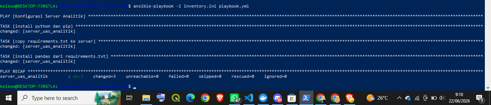

> Judul: Aplikasi Analisis Data Nilai Berbasis Docker dan CI/CD
>
> Deskripsi Proyek: 
Aplikasi ini merupakan program python sederhana yang digunakan untuk melakukan analisis data nilai. Data nilai diambil dari environment variable (DATA_NILAI), yang kemudian diproses menggunakan library pandas untuk menghitung rata-rata. Hasil analisis akan ditampilkan di terminal dan juga disimpan dalam file CSV agar dapat digunakan kembali.

 > Arsitektur Sistem:
Aplikasi ini menggunakan Docker dengan base image (python:3.9-slim) karena image ini ringan, stabil, dan sudah menyediakan environment python yang siap digunakan. Base image ini memproses build dengan cepat dan efisien karena ukurannya yang lebih kecil dibanding image full python.
>
>  Sistem dijalankan menggunakan docker compose dengan dua container, yaitu container aplikasi (app) dan database (postgreSQL). Container app bertugas menjalankan script python untuk memproses data, sedangkan container database disiapkan sebagai layanan pendukung. Kedua container berjalan dalam satu network yang sama (virtual docker) sehingga dapat saling berkomunikasi.
>
>> Alur komunikasi:

>> 1. docker compose menjalankan kedua container secara bersamaan.

>> 2. container aplikasi (app) menerima input dari environment variable.
   
>> 3. data diproses di dalam container python.
   
>> 4. hasil disimpan ke folder /app/output yang terhubung ke folder lokal (output/).

> Cara Menjalankan Aplikasi (How to Run):
>> 1. docker-compose up --build: digunakan untuk menjalankan semua service yang ada dalam file docker-compose.yaml. (--build) digunakan untuk memastikan image docker dibangun terlebih dahulu sebelum container dijalankan.
>>
>> 2. menunggu proses selesai: setelah proses build dan run selesai, aplikasi akan otomatis berjalan dan menampilkan hasil analisis di terminal.
>>
>> 3. output tampil: hasil analisis akan ditampilkan di terminal dan disimpan dalam file output/hasil.csv
>> 
>> 4. docker-compose down: perintah ini digunakan jika ingin menghentikan dan menghapus container yang sedang berjalan.

> Deskripsi Penjelasan UAS Devops
>> Pada UAS dilakukan otomatisasi penyediaan server dan instalasi software menggunakan Terraform dan Ansible. Terraform digunakan untuk membuat container ubuntu sebagai simulasi server dan Ansible digunakan untuk install python, pip, dan library pandas secara otomatis. 

> Menjalankan Terraform 
>> Masuk ke direktori project berisi file main.tf dan menjalankan perintah berikut:
>> 1. terraform init: digunakan untuk mengunduh provider yang dibutuhkan Terraform.
>> 2. terraform apply: digunakan untuk membuat container ubuntu sebagai server analitik.

> Menjalankan Ansible
>> Apabila server berhasil dibuat oleh Terraform, selanjutnya menjalankan perintah berikut:
>> ansible-playbook -i inventory.ini playbook.yml
>> Perintah tersebut akan menjalankan playbook Ansible untuk:
>> 1. install python3 dan pip menggunakan mode raw
>> 2. menyalin file requirements.txt ke server
>> 3. install library pandas secara otomatis

Hasil Play Recap 
### screenshot hasil 

Hasil eksekusi menunjukkan bahwa seluruh proses instalasi python, pip, dan pandas berhasil dijalankan menggunakan Ansible dengan status failed=0.
